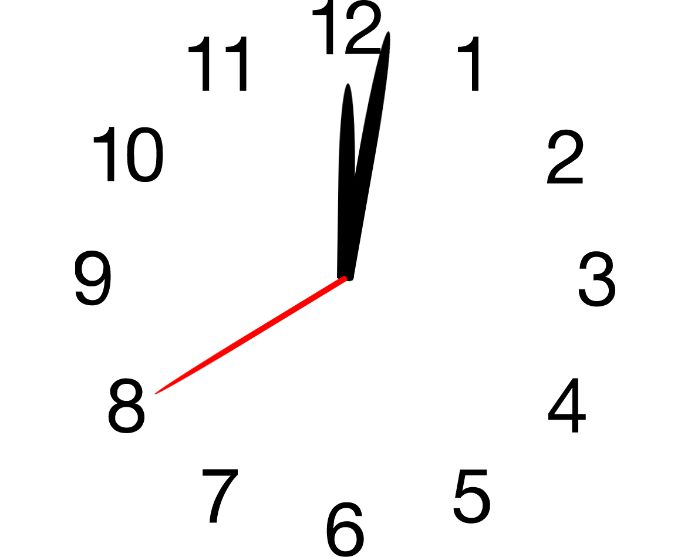

# Analog Clock

This is a little fun project to play around with CSS and it's animations. It recreates an anolog clock that starts from 00:00:00.

The time on this clock is running 8 times faster than normal to not get bored looking at it. This can be adjusted in the ```styles/style.css``` file

### Preview
